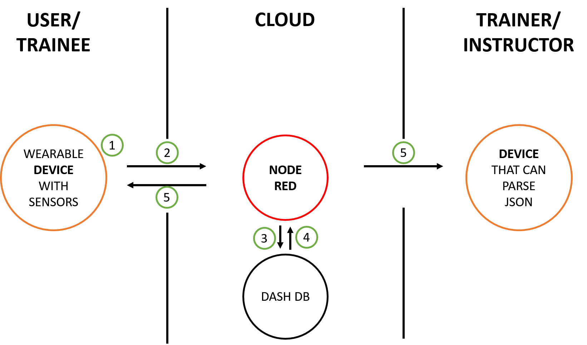
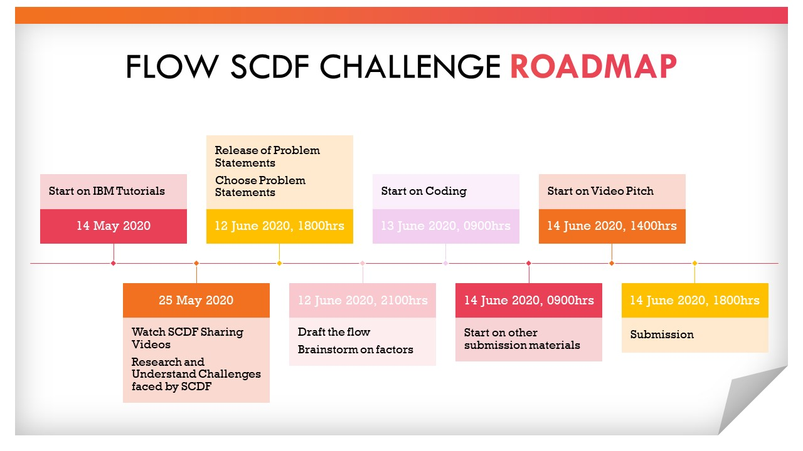

# Origin: Code Red

## Contents

1. [Short description](#short-description)
1. [Demo video](#demo-video)
1. [The architecture](#the-architecture)
1. [Long description](#long-description)
1. [Project roadmap](#project-roadmap)
1. [Getting started](#getting-started)
1. [Running the tests](#running-the-tests)
1. [Built with](#built-with)
1. [Authors](#authors)
1. [Acknowledgments](#acknowledgments)

## Short description <a name="short-description"></a>

Climate change is a critical challenge for our generation. In the context of the SCDF, there is an urgent need to rethink how climate change might affect its ability to respond effectively to its operational challenges. There is a greater physical strain placed on First Responders when a harsher environmental conditions adversely impact the way they train and operate.

### What's the problem?

There is a lack of tools to measure comprehensive personnel and equipment status for training or firefighting purposes. In the few cases where there are existing tools, they are inconsistent in sending out an appropriate output based on the data collected.

### How can technology help?

Technology in the form of sensors can provide record and relay biometrics and equipment information in real time to a central database. These data passes through an algorithm to eventually provide a holistic assessment of the user's safety. The user or the officer in charge is able to make a more informed decision on the plan going forward to maximize safety, health and performance. 


### The Idea

Although biometric tracking sensors have already been around for some time, creating a set of open source tools, backed by the Node-Red platform and DashDB augments the level of insight we can glean from the existing sensor data. 

## Demo Video <a name="demo-video"></a>

https://youtu.be/NkYlpIksUN0

## The Architecture <a name="the-architecture"></a>



<br>
1: Device receive inputs from user <br>
2: Node-RED receives the information hosted in IBM Cloud  <br>
3: Node-RED saves data to Dash DB  <br>
4: Node-RED receives data from Dash DB  <br>
5: Node-RED sends information back to user and trainer. 


## Long description <a name="long-description"></a>


### Overview 

There are four metrics that we set out to measure and eventually aggregate them for a final safety score. 

Two of the metrics are based on an individual's heart rate, body temperature respectively. They correspond to biometric data which will be collected using a wearable tracker that will likely be worn around as a chest strap. This allows for greater accuracy in heart rate monitoring as the sensor will be situated near the heart. Furthermore, with the sensor directly in contact with the surface of the individual, body temperature measurement will also likely be more accurate without interference from ambient heat sources. 

Next, we will be tracking the ambient temperature using an API that pulls data from a weather station near Nanyang Avenue. 

Lastly, we will be tracking the pounds per square inch (PSI) level of the Breathing Apparatus (BA) tank. The BA tank is a critical piece of equipment in a firefighter's appartus. It is imperative that we have a reliable sensor output that can relay this information to the user or an officer-in-charge so we do not neccesarily endanger any firefighter who is insufficiently equipped to continue engaging in their tasks. 


### Algorithms

#### Heart Rate Risk Algorithm

Using a research article that has suggested that the optimum training intensity occurs when athletes train between 50% to 70% of their maximum heart rate, we have set up three zones that take these critical values as a benchmark. The algorithm returns a green status when the current heart rate is below 50% of their historical maximum heart rate, yellow for a heart rate between 50-70%, red for a heart rate above 70%.  


#### Body Temperature Risk Algorithm


```python

```

#### Breathing Apparatus (BA) Tank Percent Left Algorithm

Each tank has a starting PSI of 30 when it is completely filled with air. This algorithm measures the percentage of air remaining in the tank. It returns a green status if there is 70% remaining air, yellow status for above 25% and below 75%, red status below 25%. 

### Final Safety Score

Each metric will return a green, yellow, red status with a corresponding score after passing the data through the appropriate algorithms. 
We take the individual's heart rate, body temperature and ambient temperature and aggregate a final safety score which has a minimum value of 3 and a maximum value of 9. The lower the score, the better the overall condition of the firefighter.

The scoring is as follows: 

[3-4] : Overall Green Status <br>
[5-6]: Overall Yellow Status <br>
[7-9]: Overall Red Status 


If no heart rate and body temperature is detected, the output will throw a device error and idle.


### Overriding Feature

If any of the metrics return an individual red status, the final safety score will automatically signal a red alert to halt all activities. 

## Project Roadmap<a name="project-roadmap"></a>



## Getting Started <a name ="getting-started"></a>

These instructions will get you a copy of the project up and running on your local machine for development and testing purposes. 

### Prerequisites


This test requires the use of Node-RED on IBM. You will require a Web Browser compatible with Node-RED on IBM. <br>
You can find a running system to test at https://node-red-pefcn.mybluemix.net/red/ . Open the link on your Web Browser. <br>
Since there are no devices connected to the flow at the moment, use the Assigned Node for Simulation of Device. <br>

## Running the tests <a name="running-the-tests"></a>


You may change the values in the following nodes to simulate different conditions:<br>
1. "Temperature Input" - Manipulates the body temperature of the device wearer.<br>
2. "Training Heart Rate Input" - Manipulates the Heart Rate of the device wearer.<br>
3. "BA Tank Input" - Manipulates the pounds per square inch (PSI) level of the Breathing Apparatus tank.<br>


### Outcome

Once you input your desired value, inject the Node "SIMULATE INPUT FROM WEARER" to start the test.<br>
<br>
There will be 2 payloads, 1 to the Trainer's Device, 1 to the Wearer's Device.<br>
<br>
The payload to Trainer's Device will transmit the Wearer's biometric status and compute the safety indexes.<br>
The payload to Wearer's Device will vibrate to provide a physical stimulus that indicates the following; biometric status are compromised or the Breathing Apparatus tank is running low.<br>

If no heart rate and body temperature is detected, the output will throw a device error and idle.


## Built With <a name="built-with"></a>

* [Node Red](https://nodered.org) - Architecture Framework
* Our Project Framework Using Node Red (https://node-red-pefcn.mybluemix.net/red)
* [DB2](https://www.ibm.com/sg-en/analytics/db2) - Database Management System Used

## Authors <a name="authors"></a>

Putra Syafiq bin Roslan <br>
Low Hui Lin <br>
Tan Zhi En, Joshua <br>
Gabriel Hsu Kai Nan <br>
Yvonne Teo Shi Ching 

## Acknowledgments <a name= "acknowledgments"></a>

* Based on [Billie Thompson's README template](https://gist.github.com/PurpleBooth/109311bb0361f32d87a2).

 * Research article on ideal exercise heart rate: https://www.healthline.com/health/athlete-heart-rate#ideal-exercising-rate


```python

```
