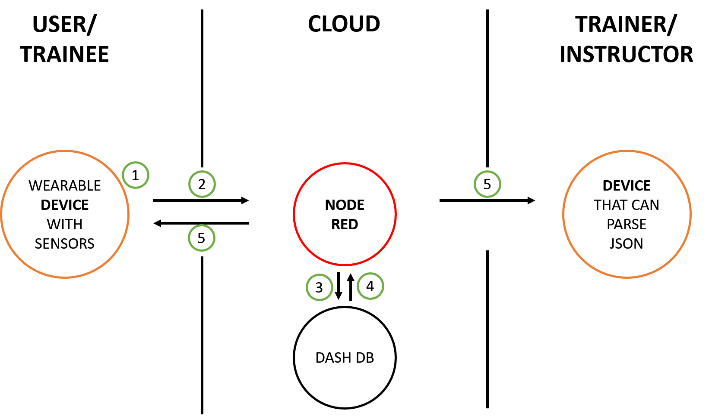
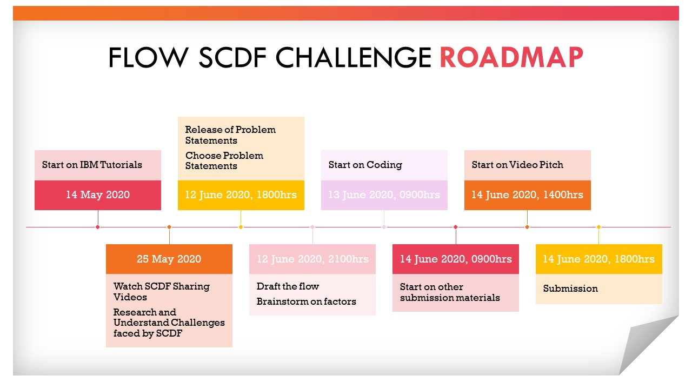

# Flow SCDF Challenge

## Contents

1. [Short description](#short-description)
1. [Demo video](#demo-video)
1. [The architecture](#the-architecture)
1. [Long description](#long-description)
1. [Project roadmap](#project-roadmap)
1. [Getting started](#getting-started)
1. [Running the tests](#running-the-tests)
1. [Built with](#built-with)
1. [Authors](#authors)
1. [Acknowledgments](#acknowledgments)

## Short description <a name="short-description"></a>

Climate change is a critical challenge for our generation. In the context of the SCDF, there is an urgent need to rethink how climate change might affect its ability to respond effectively to its operational challenges. There is a greater physical strain placed on First Responders when a harsher environmental conditions adversely impact the way they train and operate.

### What's the problem?

There is a lack of tools to measure comprehensive personnel and equipment status for training or firefighting purposes. 

### How can technology help?

Technology in the form of sensors can provide record and relay biometrics and equipment information in real time to a central database. These data passes through an algorithm to eventually provide a holistic assessment of the user's safety. The user or the officer in charge is able to make a more informed decision on the plan going forward to maximize safety, health and performance. 


### The idea

Although biometric tracking sensors have already been around for some time, creating a set of open source tools, backed by the Node-Red platform and DashDB augments the level of insight we can glean from the existing sensor data. 

## Demo Video <a name="demo-video"></a>

Summary, Situational Analysis and Key issues
Analyse the given problem statement, including a situational analysis and key
issues your team is targeting.


b. Strategy and Recommendations
Clear explanation of the justification and direct impact of solution, including
how coding and IBM Cloud is used in the solution.
c. Implementation and Plan of Action
Explain how your team will feasibly implement the solution, including possible
challenges and mitigation strategies.
d. Conclusion
Final summary of how your solution directly responds to the problem statement.

## The Architecture <a name="the-architecture"></a>



<br>
1: Device receive inputs from user <br>
2: Node-RED receives the information hosted in IBM Cloud  <br>
3: Node-RED saves data to Dash DB  <br>
4: Node-RED receives data from Dash DB  <br>
5: Node-RED sends information back to user and trainer. 


## Long description <a name="long-description"></a>


## Project Roadmap<a name="project-roadmap"></a>




```python

```


```python

```

## Running the tests <a name="running-the-tests"></a>


This test requires the use of Node-RED on IBM. You will require a Web Browser compatible with Node-RED on IBM. <br>
You can find a running system to test at https://node-red-pefcn.mybluemix.net/red/ . Open the link on your Web Browser. <br>
Since there are no devices connected to the flow at the moment, use the Assigned Node for Simulation of Device. <br>
<br>
You may change the values in the following nodes to simulate different conditions:<br>
"Temperature Input" - Manipulates the body temperature of the device wearer.<br>
"Training Heart Rate Input" - Manipulates the Heart Rate of the device wearer.<br>
"BA Tank Input" - Manipulates the PSI level of the Breathing Apparatus tank.<br>


### Outcome

Once you input your value, inject the Node "SIMULATE INPUT FROM WEARER" to start the test.<br>
<br>
There will be 2 payloads, 1 to the Trainer's Device, 1 to the Wearer's Device.<br>
<br>
The payload to Trainer's Device will transmit the Wearer's biometric status and compute the safety indexes.<br>
The payload to Wearer's Device will vibrate if biometric status are compromised or the Breathing Apparatus tank is running low.<br>

If no heart rate and body temperature is detected, the output will throw a device error and idle.

## Authors <a name="authors"></a>


```python

```

## Acknowledgments <a name= "acknowledgments"></a>

* Based on [Billie Thompson's README template](https://gist.github.com/PurpleBooth/109311bb0361f32d87a2).


```python

```
